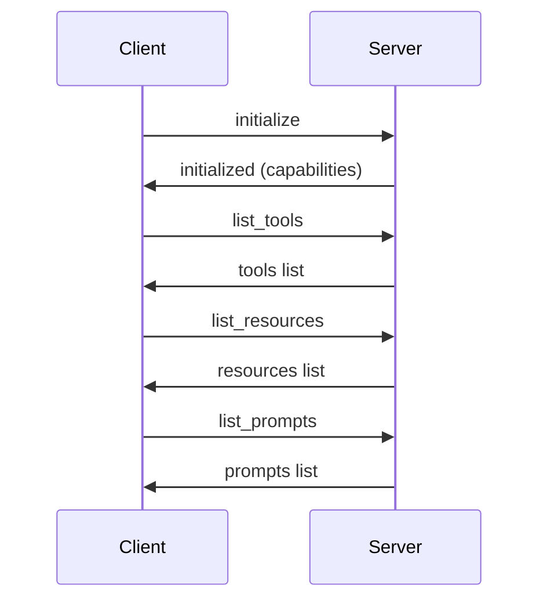
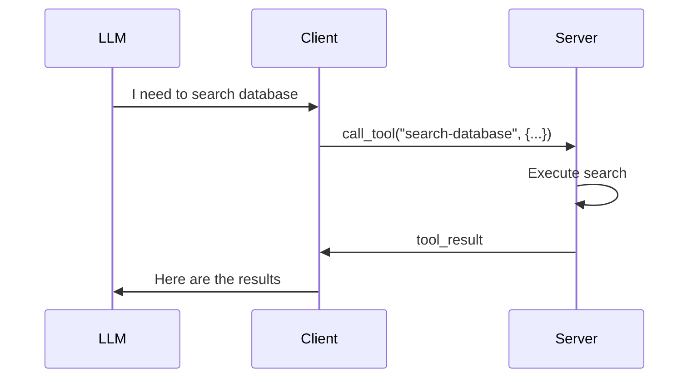
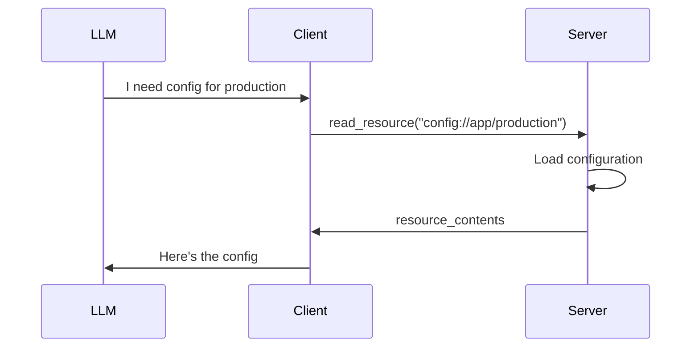

# Core MCP Concepts

The Model Context Protocol (MCP) enables seamless integration between Large Language Models (LLMs) and external data sources, tools, and services. This guide explains the fundamental concepts you need to understand to build effective MCP implementations.

## 🏗️ Architecture Overview

MCP follows a client-server architecture where:

```
┌─────────────────┐    ┌─────────────────┐    ┌─────────────────┐
│      LLM        │◄──►│   MCP Client    │◄──►│   MCP Server    │
│   (ChatGPT,     │    │                 │    │                 │
│    Claude, etc) │    │ ┌─────────────┐ │    │ ┌─────────────┐ │
│                 │    │ │ JSON-RPC    │ │    │ │ JSON-RPC    │ │
│                 │    │ │ Handler     │ │    │ │ Handler     │ │
│                 │    │ └─────────────┘ │    │ └─────────────┘ │
│                 │    │ ┌─────────────┐ │    │ ┌─────────────┐ │
│                 │    │ │ Transport   │ │    │ │ Transport   │ │
│                 │    │ │(STDIO/HTTP) │ │    │ │(STDIO/HTTP) │ │
│                 │    │ └─────────────┘ │    │ └─────────────┘ │
└─────────────────┘    └─────────────────┘    └─────────────────┘
                                │                      │
                                └──── Network/IPC ─────┘
```

### Key Roles

- **LLM**: The AI model that needs external capabilities
- **MCP Client**: Connects to servers and makes capabilities available to LLMs  
- **MCP Server**: Provides tools, resources, and other capabilities
- **Transport**: Communication layer (STDIO, HTTP, WebSocket)

## 🧩 Core Capabilities

MCP servers can provide four types of capabilities to LLMs:

### 1. Tools 🔧

Tools are **callable functions** that servers provide to clients. They:

- Have structured input/output schemas
- Can perform actions or computations
- Return results that LLMs can use
- Support both synchronous and asynchronous operations

**Example Use Cases**:
- Database queries
- API calls  
- File operations
- Mathematical calculations
- Code execution

**Code Example**:
```php
$server->registerTool(
    'search-database',
    [
        'description' => 'Search the customer database',
        'inputSchema' => [
            'type' => 'object',
            'properties' => [
                'query' => ['type' => 'string'],
                'limit' => ['type' => 'integer', 'default' => 10]
            ],
            'required' => ['query']
        ]
    ],
    function (array $params): array {
        $results = Database::search($params['query'], $params['limit'] ?? 10);
        
        return [
            'content' => [[
                'type' => 'text',
                'text' => json_encode($results, JSON_PRETTY_PRINT)
            ]]
        ];
    }
);
```

### 2. Resources 📦

Resources are **data sources** that clients can read. They:

- Provide structured or unstructured data
- Support URI-based addressing with templates
- Can be static files, database records, API responses, etc.
- Include metadata like MIME types and descriptions

**Example Use Cases**:
- Configuration files
- Documentation
- Database records
- API responses  
- Media files

**Code Example**:
```php
$server->registerResource(
    'config://app/{environment}',
    [
        'name' => 'Application Configuration',
        'description' => 'Environment-specific app configuration',
        'mimeType' => 'application/json'
    ],
    function (string $uri): array {
        preg_match('/config:\/\/app\/(.+)/', $uri, $matches);
        $env = $matches[1];
        
        $config = ConfigManager::load($env);
        
        return [
            'contents' => [[
                'uri' => $uri,
                'mimeType' => 'application/json',
                'text' => json_encode($config, JSON_PRETTY_PRINT)
            ]]
        ];
    }
);
```

### 3. Prompts 💭

Prompts are **templates** that help LLMs understand how to use server capabilities. They:

- Provide context and instructions
- Support dynamic arguments
- Guide LLM behavior and responses  
- Can include examples and best practices

**Example Use Cases**:
- Code review guidelines
- Analysis templates
- Response formatting
- Domain-specific instructions

**Code Example**:
```php
$server->registerPrompt(
    'code-review',
    [
        'name' => 'Code Review Assistant',
        'description' => 'Helps review code changes',
        'arguments' => [
            [
                'name' => 'language',
                'description' => 'Programming language',
                'required' => true
            ],
            [
                'name' => 'complexity',
                'description' => 'Code complexity level',
                'required' => false
            ]
        ]
    ],
    function (array $arguments): array {
        $language = $arguments['language'];
        $complexity = $arguments['complexity'] ?? 'medium';
        
        return [
            'description' => "Code review for {$language} code",
            'messages' => [[
                'role' => 'system',
                'content' => [
                    'type' => 'text',
                    'text' => "You are reviewing {$language} code at {$complexity} complexity level. Focus on:\n\n1. Code correctness\n2. Performance implications\n3. Security considerations\n4. Best practices\n5. Maintainability\n\nProvide specific, actionable feedback."
                ]
            ]]
        ];
    }
);
```

### 4. Sampling 🎯

Sampling allows servers to **request LLM completions**. This enables:

- LLM-powered processing within server logic
- Multi-step AI workflows  
- Dynamic content generation
- Intelligent data analysis

**Example Use Cases**:
- Content generation
- Data analysis
- Translation
- Summarization

**Code Example**:
```php
$server->registerTool(
    'analyze-sentiment',
    [
        'description' => 'Analyze sentiment of text using LLM',
        'inputSchema' => [
            'type' => 'object', 
            'properties' => [
                'text' => ['type' => 'string']
            ],
            'required' => ['text']
        ]
    ],
    function (array $params) use ($server): array {
        // Request LLM to analyze sentiment
        $result = yield $server->requestSampling([
            'messages' => [[
                'role' => 'user',
                'content' => [
                    'type' => 'text',
                    'text' => "Analyze the sentiment of this text and provide a score from -1 (negative) to 1 (positive):\n\n{$params['text']}"
                ]
            ]],
            'maxTokens' => 50
        ]);
        
        return [
            'content' => [[
                'type' => 'text',
                'text' => $result['completion']
            ]]
        ];
    }
);
```

## 🔄 Protocol Flow

### Initialization Sequence



### Tool Execution



### Resource Access



## 🔌 Transport Layers

MCP supports multiple transport mechanisms:

### STDIO Transport

**Best for**: Command-line tools, local development, process-based integration

```php
use MCP\Server\Transport\StdioServerTransport;

$transport = new StdioServerTransport();
yield $server->connect($transport);
```

**Characteristics**:
- ✅ Simple setup
- ✅ No network configuration  
- ✅ Secure (process isolation)
- ❌ Single client only
- ❌ Local machine only

### HTTP Streaming Transport

**Best for**: Web applications, multiple clients, cloud deployment

```php
use MCP\Server\Transport\HttpServerTransport;

$transport = new HttpServerTransport([
    'host' => '0.0.0.0',
    'port' => 3000,
    'cors' => true
]);
yield $server->connect($transport);
```

**Characteristics**:
- ✅ Multiple clients
- ✅ Network accessible
- ✅ Standard HTTP protocol
- ✅ Load balancing support  
- ❌ More complex setup
- ❌ Requires network security

### WebSocket Transport (Coming Soon)

**Best for**: Real-time applications, bidirectional communication

```php
use MCP\Server\Transport\WebSocketServerTransport;

$transport = new WebSocketServerTransport([
    'host' => '0.0.0.0',
    'port' => 8080,
    'ssl' => true
]);
yield $server->connect($transport);
```

## 🔒 Security Model

### Authentication

MCP supports multiple authentication methods:

```php
use MCP\Server\Auth\OAuth2Provider;

$authProvider = new OAuth2Provider([
    'clientId' => 'your-client-id',
    'clientSecret' => 'your-client-secret',
    'scopes' => ['read', 'write'],
    'pkce' => true
]);

$server->setAuthProvider($authProvider);
```

### Authorization

Control access to capabilities:

```php
$server->registerTool(
    'admin-tool',
    $config,
    function (array $params, ?User $user = null): array {
        if (!$user || !$user->hasRole('admin')) {
            throw new McpError(
                ErrorCode::Forbidden,
                'Admin access required'
            );
        }
        
        // Tool logic here...
    }
);
```

### Input Validation

Always validate inputs:

```php
use Respect\Validation\Validator as v;

$server->registerTool(
    'validated-tool', 
    [
        'inputSchema' => [
            'type' => 'object',
            'properties' => [
                'email' => ['type' => 'string', 'format' => 'email'],
                'age' => ['type' => 'integer', 'minimum' => 0, 'maximum' => 150]
            ]
        ]
    ],
    function (array $params): array {
        // Schema validation happens automatically
        
        // Additional validation if needed
        if (!v::email()->validate($params['email'])) {
            throw new McpError(
                ErrorCode::InvalidParams,
                'Invalid email format'
            );
        }
        
        return $result;
    }
);
```

## ⚡ Async Programming

PHP MCP SDK uses Amphp for async operations:

### Basic Async Patterns

```php
use Amp\Loop;

// Create async function
Amp\async(function() {
    // Async operations use yield
    $result = yield $client->callTool('example');
    
    // Handle multiple operations concurrently
    $promises = [
        $client->callTool('tool1'),
        $client->callTool('tool2'),
        $client->callTool('tool3')
    ];
    
    $results = yield $promises; // Wait for all to complete
    
    return $results;
});

Loop::run(); // Start the event loop
```

### Error Handling

```php
Amp\async(function() {
    try {
        $result = yield $client->callTool('example');
    } catch (McpError $e) {
        echo "MCP Error: {$e->getMessage()}\n";
    } catch (\Exception $e) {
        echo "General Error: {$e->getMessage()}\n";
    }
});
```

### Timeouts and Cancellation

```php
use Amp\TimeoutCancellation;

Amp\async(function() {
    $cancellation = new TimeoutCancellation(30); // 30 second timeout
    
    try {
        $result = yield $client->callTool('slow-tool', [], $cancellation);
    } catch (CancelledException $e) {
        echo "Operation timed out\n";
    }
});
```

## 🏗️ Design Patterns

### Repository Pattern

Organize your tools using repositories:

```php
class WeatherRepository
{
    public function getCurrentWeather(string $location): array
    {
        // Weather API logic
        return $weatherData;
    }
    
    public function getForecast(string $location, int $days): array  
    {
        // Forecast API logic
        return $forecastData;
    }
}

class WeatherTools
{
    public function __construct(
        private WeatherRepository $repository
    ) {}
    
    public function register(McpServer $server): void
    {
        $server->registerTool(
            'get-weather',
            $config,
            fn($params) => $this->handleGetWeather($params)
        );
        
        $server->registerTool(
            'get-forecast', 
            $config,
            fn($params) => $this->handleGetForecast($params)
        );
    }
    
    private function handleGetWeather(array $params): array
    {
        $weather = $this->repository->getCurrentWeather($params['location']);
        
        return [
            'content' => [[
                'type' => 'text',
                'text' => json_encode($weather)
            ]]
        ];
    }
}
```

### Factory Pattern

Create servers with different configurations:

```php
class McpServerFactory
{
    public static function createWeatherServer(): McpServer
    {
        $server = new McpServer(
            new Implementation('weather', '1.0.0')
        );
        
        $weatherTools = new WeatherTools(new WeatherRepository());
        $weatherTools->register($server);
        
        return $server;
    }
    
    public static function createDatabaseServer(): McpServer
    {
        $server = new McpServer(
            new Implementation('database', '1.0.0')  
        );
        
        $dbTools = new DatabaseTools(new DatabaseRepository());
        $dbTools->register($server);
        
        return $server;
    }
}
```

### Middleware Pattern

Add cross-cutting concerns:

```php
class LoggingMiddleware
{
    public function __construct(private Logger $logger) {}
    
    public function handle(Request $request, callable $next): Response
    {
        $this->logger->info('Tool called', [
            'tool' => $request->getMethod(),
            'params' => $request->getParams()
        ]);
        
        $response = yield $next($request);
        
        $this->logger->info('Tool completed', [
            'tool' => $request->getMethod(),
            'success' => $response->isSuccess()
        ]);
        
        return $response;
    }
}
```

## 📊 Performance Considerations

### Connection Pooling

For HTTP transports, use connection pooling:

```php
use Amp\Http\Client\HttpClientBuilder;
use Amp\Http\Client\Connection\DefaultConnectionPool;

$pool = new DefaultConnectionPool(
    maxConnectionsPerHost: 10,
    maxConnectionLifetime: 300
);

$client = (new HttpClientBuilder())
    ->withConnectionPool($pool)
    ->build();
```

### Caching

Implement caching for expensive operations:

```php
use Amp\Cache\ArrayCache;

class CachedWeatherRepository extends WeatherRepository
{
    public function __construct(
        private WeatherRepository $repository,
        private ArrayCache $cache
    ) {}
    
    public function getCurrentWeather(string $location): array
    {
        $cacheKey = "weather:{$location}";
        
        $cached = yield $this->cache->get($cacheKey);
        if ($cached !== null) {
            return $cached;
        }
        
        $weather = $this->repository->getCurrentWeather($location);
        
        yield $this->cache->set($cacheKey, $weather, 300); // 5 min TTL
        
        return $weather;
    }
}
```

### Request Batching

Batch multiple operations:

```php
$server->registerTool(
    'batch-weather',
    $config,
    function (array $params): array {
        $locations = $params['locations'];
        
        // Process all locations concurrently
        $promises = array_map(
            fn($location) => $this->getWeatherAsync($location),
            $locations
        );
        
        $results = yield $promises;
        
        return [
            'content' => [[
                'type' => 'text', 
                'text' => json_encode($results)
            ]]
        ];
    }
);
```

## 🧪 Testing Strategies

### Unit Testing

```php
use PHPUnit\Framework\TestCase;
use MCP\Tests\MockTransport;

class WeatherServerTest extends TestCase
{
    public function testWeatherTool(): void
    {
        $server = McpServerFactory::createWeatherServer();
        $transport = new MockTransport();
        
        yield $server->connect($transport);
        
        $response = yield $transport->callTool('get-weather', [
            'location' => 'London'
        ]);
        
        $this->assertArrayHasKey('content', $response);
        $this->assertNotEmpty($response['content']);
    }
}
```

### Integration Testing

```php
use MCP\Client\Client;
use MCP\Client\Transport\StdioClientTransport;

class WeatherIntegrationTest extends TestCase
{
    public function testFullWorkflow(): void
    {
        $client = new Client(new Implementation('test', '1.0.0'));
        $transport = new StdioClientTransport([
            'command' => 'php',
            'args' => [__DIR__ . '/../weather-server.php']
        ]);
        
        yield $client->connect($transport);
        
        $tools = yield $client->listTools();
        $this->assertNotEmpty($tools['tools']);
        
        $result = yield $client->callTool('get-weather', [
            'location' => 'Test City'
        ]);
        
        $this->assertArrayHasKey('content', $result);
        
        yield $client->close();
    }
}
```

## 🚀 Next Steps

Now that you understand MCP concepts:

1. [🖥️ Build Advanced Servers](../guides/creating-servers.md)
2. [📱 Create Robust Clients](../guides/creating-clients.md)  
3. [🔐 Implement Security](../guides/authentication.md)
4. [🔌 Choose Transport Layers](../guides/transports.md)
5. [🏗️ Framework Integration](../guides/laravel-integration.md)

## 📚 Additional Resources

- [MCP Specification](https://spec.modelcontextprotocol.io/)
- [TypeScript SDK Documentation](https://github.com/modelcontextprotocol/typescript-sdk)
- [Example Implementations](../examples/README.md)
- [Community Discussion](https://github.com/dalehurley/php-mcp-sdk/discussions)

Understanding these core concepts will help you build powerful, efficient, and secure MCP implementations! 🎯